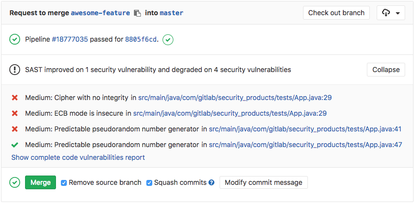

# Static Application Security Testing (SAST)

> [Introduced][ee-3775] in [GitLab Enterprise Edition Ultimate][ee] 10.3.

## Overview

If you are using [GitLab CI/CD][ci], you can analyze your source code for known
vulnerabilities using Static Application Security Testing (SAST), either by
including the CI job in your [existing `.gitlab-ci.yml` file][cc-docs] or
by implicitly using [Auto SAST](../../../topics/autodevops/index.md#auto-sast)
that is provided by [Auto DevOps](../../../topics/autodevops/index.md).

Going a step further, GitLab can show the vulnerability list right in the merge
request widget area:

## Use cases

- Your application is using an external (open source) library, locked to a
  specific version (e.g., via `Gemfile.lock`) and the version is known to be
  vulnerable.
- Your code has a potentially dangerous attribute in a class, or unsafe code
  that can lead to unintended code execution.

## How it works

In order for the report to show in the merge request, you need to specify a
`sast` job (exact name) that will analyze the code and upload the resulting
`gl-sast-report.json` file as an artifact. GitLab will then check this file and
show the information inside the merge request.

This JSON file needs to be the only artifact file for the job. If you try
to also include other files, it will break the vulnerability display in the
merge request.

For more information on how the `sast` job should look like, check the
[example on analyzing a project's code for vulnerabilities][cc-docs].

[ee-3775]: https://gitlab.com/gitlab-org/gitlab-ee/issues/3775
[ee]: https://about.gitlab.com/gitlab-ee/
[ci]: ../../../ci/README.md
[cc-docs]: ../../../ci/examples/sast.md
